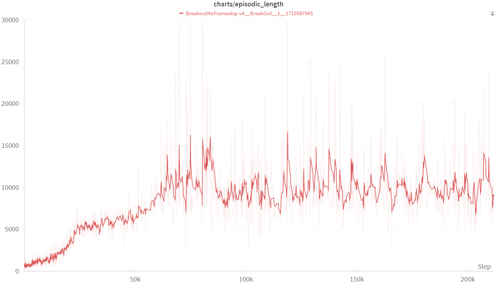
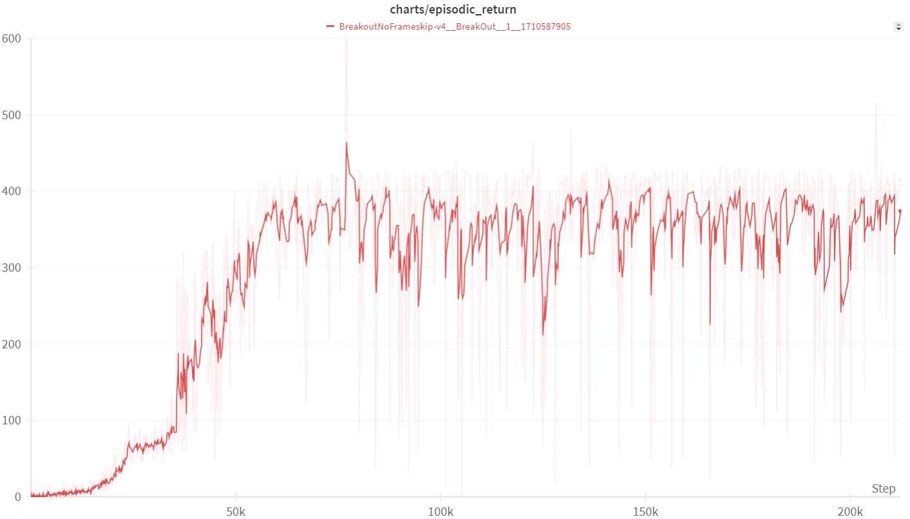
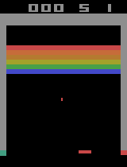
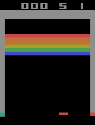
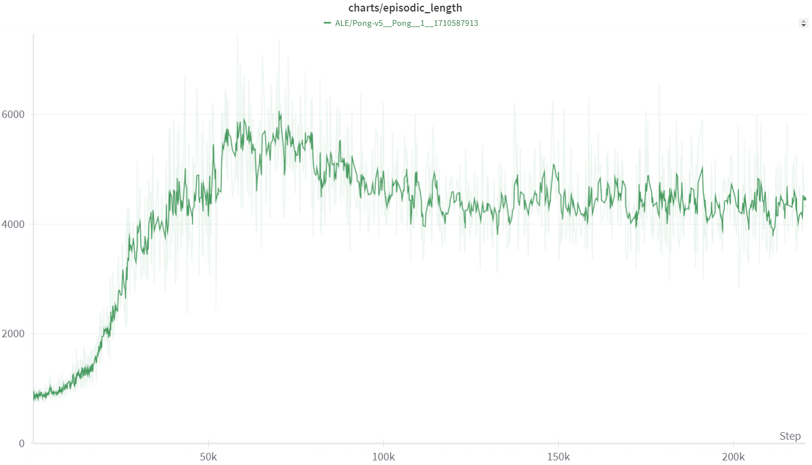
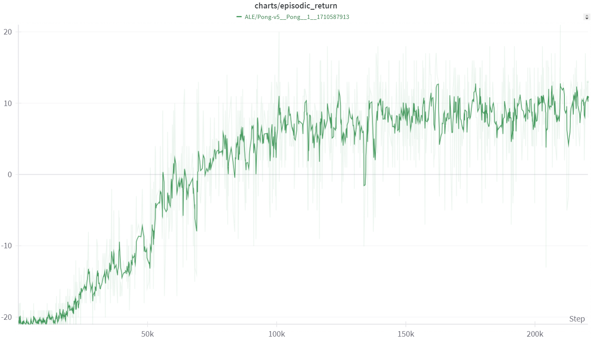
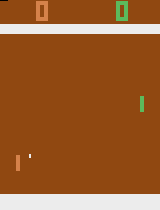
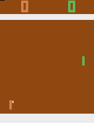
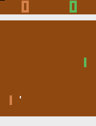

**Обучение на основе функции полезности**

Задача: воспроизвести результаты DQN на двух играх Atari.

Описание. Ваша задача — воспроизвести результаты DQN на играх Pong и другой игре на ваш выбор из таблицы лекций или семинара. Важно, чтобы вы не выбрали игру, где результат человека значительно превосходит DQN. Учтите, что некоторые игры могут потребовать специфических методов, например, MontezumaRevenge.

Цель состоит в том, чтобы ваш агент достиг среднего вознаграждения, указанного в таблице для *DQN*, с учетом std dev.

**Детали:**

* Воспользуйтесь техниками из оригинальной статьи DeepMind: *replay buffer*, *frame skip*, *target network*.
* Можно использовать любой фреймворк.
* Приветствуются улучшения базового кода или дополнительные техники.
  
**Что нужно сдать:**

* Код обучения в формате *Jupyter*.
* График сходимости, показывающий среднее вознаграждение.
* Веса обученной модели.
* Код для запуска модели с готовыми весами.
* Выводы по используемым гиперпараметрам, таким как размер *replay buffer*, *learning rate* и т. д.

### Архитектура репозитория
- Images (изображения для репозитория)
- Models (веса моделей)
- Breakout.py (код для игры breakout)
- Pong.py (код для игры pong)
- Inference.py (inference модели и создние .gif)
- requirements.txt (необходимые библиотеки для кода)

Для решения задачи выбраны 2 среды: Pong и Breakout

Breakout:


Информация о среде:
| Action Space |          Observation Space            |              Import               |
|:------------:|:-------------------------------------:|:---------------------------------:|
| Discrete(4)  |   Box(0, 255, (210, 160, 3), uint8)   | gymnasium.make("ALE/Breakout-v5") |

**Описание**

Еще одна знаменитая игра от Atari. По своей динамике она похожа на понг: Вы перемещаете пластину и бьете мячом в кирпичную стену в верхней части экрана. Ваша цель - разрушить кирпичную стену. Вы можете попытаться пробить стену и позволить мячу устроить хаос на другой стороне, причем самостоятельно! У вас есть пять жизней.

Pong:


| Action Space |          Observation Space            |              Import               |
|:------------:|:-------------------------------------:|:---------------------------------:|
| Discrete(6)  | Box(0, 255, (210, 160, 3), uint8)     | gymnasium.make("ALE/Pong-v5") |

**Описание**

Вы управляете правой ракеткой и соревнуетесь с левой ракеткой, которым управляет компьютер. Каждый из вас старается отклонить мяч от своих ворот в ворота противника.

Архтектура модели DQN:
```python
        self.network = nn.Sequential(
            nn.Conv2d(4, 32, 8, stride=4),
            nn.ReLU(),
            nn.Conv2d(32, 64, 4, stride=2),
            nn.ReLU(),
            nn.Conv2d(64, 64, 3, stride=1),
            nn.ReLU(),
            nn.Flatten(),
            nn.Linear(3136, 512),
            nn.ReLU(),
            nn.Linear(512, env.single_action_space.n),
```

Replay buffer используется от SB3
```python
    rb = ReplayBuffer(
        buffer_size,
        envs.single_observation_space,
        envs.single_action_space,
        device,
        optimize_memory_usage=True,
        handle_timeout_termination=False,
    )
```

Гиперпараметры модели показаны в таблице ниже


| Game         | Num. Timesteps | learning rate  | buffer size   |     gamma    |       tau      |  target network frequency | batch size |
|:------------:|:--------------:|:--------------:|:-------------:|:------------:|:--------------:|:-------------------------:|:----------:|
| Breakout     | 10_000_000     | 1e-4           | 1_000_000     | 0.99         | 1.0            | 1000                      | 32         |
| Pong         | 10_000_000     | 1e-4           | 1_000_000     | 0.99         | 0.8            | 800                       | 32         |

- *Num. Timesteps* - количество временных шагов. По факту чем больше тем лучше. Чем больше алгоритм DQN получит переходов, тем больше и лучше будет он работать со средой.
- *Learning rate* - скорость обучения. Подбираемый параметр. В этих играх был выбран 0.0001
- *Buffer size* -  размер буффера для хранения переходов. Чем больше буффер тем лучше. Если есть проблемы с памятью, то можно использовать буффер с приоритезацией.
- *gammа* - параметр дисконтирования. Гамма 0.99 говорит о том, что агент выбирает действия, которые приведут его к максимизации награды. Т.е. возможно будет учитываться отскок мяча или проделывания прохода в воротах, чтобы мяч попал на заднюю часть и принёс множество очков
- *tau* и *target network frequency* - параметры обновления обучаемой сети. Чем выше скорость обновления, там меньше tau, т.е. мы делаем предположение, что прирост не большой и q сеть будет обучаться стабильно. В обратном случае, при малой скорости обновления сети мы релаксируем tau, чтобы большие изменения не повлияли на обучения агента.
- *batch size* - размер пакета. Обычно от 32 до 256 для RL. Так же идёт в комбинации с tau и скорость обновления. Чем медленнее обновление тем больше батч и наоборот. 


### Графики обучения среды Breakout:

Результаты расчёта логировались с помощью wandb:

График длины эпизода показан ниже [Episodic length](https://wandb.ai/starkirill90/Homework_2/reports/charts-episodic_length-24-03-17-16-12-40---Vmlldzo3MTg2NDUz?accessToken=ihdyijeyjk10vksxpboaz2q2f1y3rrf4zryn1hmlt1w5kqwqck8crmiua4a7e8ke)


График длины эпизода показан ниже [Episodic return](https://wandb.ai/starkirill90/Homework_2/reports/charts-episodic_return-24-03-17-16-13-12---Vmlldzo3MTg2NDU2?accessToken=sls2soistu6kuu3fvotkspm4jhnj1mtgatia7b3qgp4ul2f5zwp9d544vyv2f5pr)


Видео в формате .gif прохождения агентом игры показано ниже

После обучения в 5_000 шагов



После обучения в 1_000_000 шагов


После обучения в 8_000_000 шагов



### Графики обучения среды Pong:

График длины эпизода показан ниже [Episodic length](https://wandb.ai/starkirill90/Homework_2/reports/charts-episodic_length-24-03-17-16-12-40---Vmlldzo3MTg2NDUz?accessToken=ihdyijeyjk10vksxpboaz2q2f1y3rrf4zryn1hmlt1w5kqwqck8crmiua4a7e8ke)


График длины эпизода показан ниже [Episodic return](https://wandb.ai/starkirill90/Homework_2/reports/charts-episodic_return-24-03-17-16-13-12---Vmlldzo3MTg2NDU2?accessToken=sls2soistu6kuu3fvotkspm4jhnj1mtgatia7b3qgp4ul2f5zwp9d544vyv2f5pr)


Видео в формате .gif прохождения агентом игры показано ниже

После обучения в 5_000 шагов



После обучения в 1_000_000 шагов



После обучения в 8_000_000 шагов




