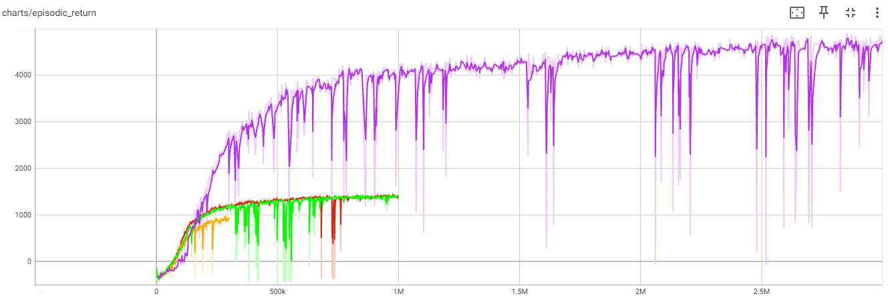
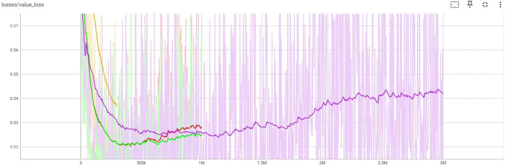

Методы семейства «актор-критик»

Задача: обучить агента действовать в средах с непрерывным пространством действий, используя алгоритм SAC (Soft Actor Critic) или PPO (Proximal Policy Optimization).

**Описание**

Ваша задача — обучить агента в одной из следующих сред: Half Cheetah, Walker2D, Humanoid, Inverted Double Pendulum. Эти среды доступны в библиотеках gym, pybullet-gym или DeepMind Control Suite. Цель заключается в том, чтобы добиться хорошего результата в минимум трех из четырех указанных сред. Приветствуется проведение экспериментов с различными гиперпараметрами.

**Детали:**

* Рекомендуется использовать алгоритмы SAC или PPO для обучения.
* Проведите эксперименты с разными гиперпараметрами для достижения наилучших результатов.
* Пользуйтесь предоставленными ссылками и примерами для установки и использования необходимых библиотек.

**Что нужно сдать:**

* Код обучения в формате Jupyter.
* График сходимости, показывающий среднее вознаграждение.
* Веса обученной модели.
* Код для запуска модели с готовыми весами.
* Выводы по используемым гиперпараметрам.


### Архитектура репозитория
- Images (изображения для репозитория)
- runs (веса моделей, .gif и логи для тензорборда)
- HalfCheetah.py (код для среды half-cheetah)
- ppo_inference.py (inference модели и создние .gif)
- requirements.txt (необходимые библиотеки для кода)

Для решения задачи выбраны 2 среды: Pong и Breakout

Breakout:


Информация о среде:

|       Пространство действий       |    Пространство наблюдений     |              Import              |
|:---------------------------------:|:------------------------------:|:--------------------------------:|
|   Box(-1.0, 1.0, (6,), float32)   | Box(-inf, inf, (17,), float64) | gymnasium.make("HalfCheetah-v4") |

**Описание**

Эта среда основана на работе P. Wawrzyński “A Cat-Like Robot Real-Time Learning to Run”. HalfCheetah - это двумерный робот, 
состоящий из 9 частей тела и 8 суставов, соединяющих их (включая две лапы). Цель - приложить крутящий момент к суставам, 
чтобы заставить гепарда бежать вперед (вправо) как можно быстрее, при этом положительное вознаграждение начисляется в 
зависимости от пройденного расстояния, а отрицательное - за движение назад. 
Туловище и голова гепарда неподвижны, и крутящий момент может быть приложен только к остальным 6 суставам: передним 
и задним бедрам (соединяются с туловищем), голеням (соединяются с бедрами) и ступням (соединяются с голенями).

**Пространство действий**

Пространство действий - это *Box(-1, 1, (6,), float32)*. Действие представляет собой крутящий момент, приложенный 
к шарнирным соединениям.

**Пространство наблюдений**

Наблюдения состоят из позиционных значений различных частей тела гепарда, а затем скоростей этих частей (их производных), 
причем все позиции упорядочены перед всеми скоростями.

**Вознаграждение**

Вознаграждение состоит из двух частей:

forward_reward: Награда за движение вперед, которая измеряется как 
*forward_reward_weight * (x-координата перед действием - x-координата после действия)/dt*. 
*dt* - это время между действиями и зависит от параметра frame_skip (фиксировано на 5), 
где *frame-time* равен 0.01 - что делает *dt* по умолчанию = 5 * 0.01 = 0.05. 
Это вознаграждение будет положительным, если гепард побежит вперед (справа).

*ctrl_cost*: Затраты на наказание гепарда, если он совершает слишком большие действия. 
Она измеряется как *ctrl_cost_weight * sum(action2)*, где *ctrl_cost_weight* - это параметр, задаваемый для 
управления и имеющий значение по умолчанию 0,1.

Общее вознаграждение возвращается в виде *reward = forward_reward - ctrl_cost*, а информация также будет 
содержать индивидуальные условия вознаграждения

**Начальное состояние**

Все наблюдения начинаются в состоянии (0.0, 0.0, 0.0, 0.0, 0.0, 0.0, 0.0, 0.0, 0.0, 0.0, 0.0, 0.0, 0.0, 0.0, 0.0, 0.0, 0.0) 
с добавлением шума в начальное состояние для стохастичности. 
Как было показано ранее, первые 8 значений в состоянии являются позиционными, а последние 9 - скоростными. 
К позиционным значениям добавляется равномерный шум в диапазоне [-reset_noise_scale, reset_noise_scale], 
а к начальным значениям скорости всех нулей добавляется стандартный нормальный шум со средним значением 0 и 
стандартным отклонением $reset_noise_scale$.


Архтектура нейронной сети модели PPO:
```python
    self.critic = nn.Sequential(
        layer_init(nn.Linear(np.array(envs.single_observation_space.shape).prod(), 64)),
        nn.Tanh(),
        layer_init(nn.Linear(64, 64)),
        nn.Tanh(),
        layer_init(nn.Linear(64, 1), std=1.0),
    )
    self.actor_mean = nn.Sequential(
        layer_init(nn.Linear(np.array(envs.single_observation_space.shape).prod(), 64)),
        nn.Tanh(),
        layer_init(nn.Linear(64, 64)),
        nn.Tanh(),
        layer_init(nn.Linear(64, np.prod(envs.single_action_space.shape)), std=0.01),
    )
    self.actor_logstd = nn.Parameter(torch.zeros(1, np.prod(envs.single_action_space.shape)))
```

Алгоритм PPO:
1. Установка значений гиперпараметров. 
2. Инициализация сетей актора и критика. 
3. Инициализация старой сети критика, чтобы она выступала в качестве при расчете вероятностного отношения $r_t(\theta)$. 
4. Обновление старой сети актора до новой. Накопление данных траекторий с помощью старой сети актора и вычисление значений преимущества и целевых $V-$значений. Затем траектории с преимуществами и целевыми $V-$значениями сохраняются в пакет, из которого будут в дальнейшем выбираться. Обратите внимание на то, что в этой версии ***актора-критика*** используются параллельные акторы. 
5. Проход по всему пакету в цикле из $K$ эпох. 
6. Выборка мини-пакетов размера $M$ из пакета. В этом блоке в расчетах применяются все элементы из мини-пакета. 
7. Вычисление усеченной суррогатной целевой функции. 
8. Определение энтропии стратегии для действий в мини-пакете. 
9. Расчет функции потерь для стратегии.
10. Определение функции потерь для функции полезности. Заметьте, что целевые $V-$значения вычисляются в пакете один раз и используются повторно. 
11. Обновление параметров актора с помощью градиента функции потерь для стратегии. 
12. Обновление параметров критика с помощью градиента функции потерь для полезностей.

Гиперпараметры использованные в модели показаны в таблице ниже

| Half-Cheetah | Total Timesteps |  learning rate   | entropy | num steps | gamma | gae lambda | num minibatches | update_epochs | clip vloss |
|:------------:|:---------------:|:----------------:|:-------:|:---------:|:-----:|:----------:|:---------------:|:-------------:|:----------:|
|    orange    |     300_000     |       3e-4       |   .0    |   2048    | 0.99  |    0.97    |       32        |      10       |    0.5     |
|     blue     |    1_000_000    |       3e-4       |   .0    |   2048    | 0.99  |    0.95    |       32        |      10       |    0.5     |
|     red      |    1_000_000    |       3e-4       |   .0    |   2048    | 0.97  |    0.95    |       32        |      10       |    0.5     |
|    green     |    1_000_000    |       2e-4       |   .0    |   2048    | 0.995 |    0.95    |       32        |      10       |    0.5     |
|    purple    |    3_000_000    |       3e-4       |   .0    |   2048    | 0.99  |    0.95    |       32        |      10       |    0.5     |


- *learning rate* (скорость обучения): Значение learning_rate установлено на 3e-4, что является типичным выбором для многих задач обучения с подкреплением. Это значение обычно обеспечивает хороший баланс между скоростью обучения и стабильностью алгоритма.

- *num step* (количество шагов в каждом среде): Значение num_steps равно 2048. Это число выбрано для того, чтобы обеспечить достаточно 
длинные эпизоды, чтобы агент мог собрать информацию о среде и сформировать надежную стратегию. Число взято из стать про PPO и A2C от создателя SB3.

- *gamma* (коэффициент дисконтирования): Значение gamma установлено на 0.99. Это значение обычно используется для задач с непрерывными пространствами состояний и действий и обеспечивает агенту учет долгосрочных последствий своих действий.

- *gae_lambda* (коэффициент lambda для обобщенной оценки преимущества): Значение gae_lambda равно 0.95. Это значение обычно используется для балансировки между смещением и дисперсией оценок преимущества и обеспечивает стабильное обучение.

- *update_epochs* (количество эпох обновления политики): Значение update_epochs установлено на 10, что обеспечивает достаточное количество обновлений политики для сходимости алгоритма.

- *clip_coef* (коэффициент обрезания суррогатной функции): Значение clip_coef равно 0.2, что является стандартным выбором для обрезания суррогатной функции в PPO и обеспечивает стабильное обучение без больших отклонений.

- *vf_coef* (коэффициент функции значения): Значение vf_coef установлено на 0.5, что обычно используется для балансировки между политикой и функцией значения в целевой функции алгоритма PPO.

- *entropy* (коэффициент энтропии): Значение ent_coef равно 0.0, что означает отсутствие использования энтропийного бонуса в данной конфигурации.

### Графики обучения среды Half-Cheetah:

Результаты расчёта логировались с помощью tensorboard:

График вознаграждения за эпизод показан ниже



График ошибки актора показан ниже


График ошибки критика показан ниже



График энтропии показан ниже


Видео в формате .gif прохождения агентом игры показано ниже

После обучения в 5_000 шагов


После обучения в 500_000 шагов


После обучения в 1_000_000 шагов


После обучения в 3_000_000 шагов


После обучения в 6_000_000 шагов
На прогонке агента на 60 эпизодах получились следующие значения среднего: 4342.069 и среднеквадратичного отклонения: 837.451


**Выводы**

1. Так модель уже начала показывать неплохие показатели, то обучение агента было окончено. По графикам ошибки актора
и критика, можно сделать вывод, что агента можно доучить в течении 3-4 млн итераций, пока ошибки актора и критика не приблизятся к 0.
2. Из графика энтропии видно, что она не стабилизировалась и не вышла на плато. Хотя наблюдается странный эффект, энтропия по графикам отрицательная, чего не может быть, т.к. логируется в графики чистая энтропия, а не $entropy_coeff \cdot entropy$
Поэтому необходимо провести дополнительние уточняющие расчёты. В целом гепард научился бегать и показывать стабильный бег вперёд, за что агенту и присуждается награда.
3. Наблюдается на инференсе на .gif, что гепард выбегает за пределы поля, возможно это ограничения среды, которое надо уточнить.

