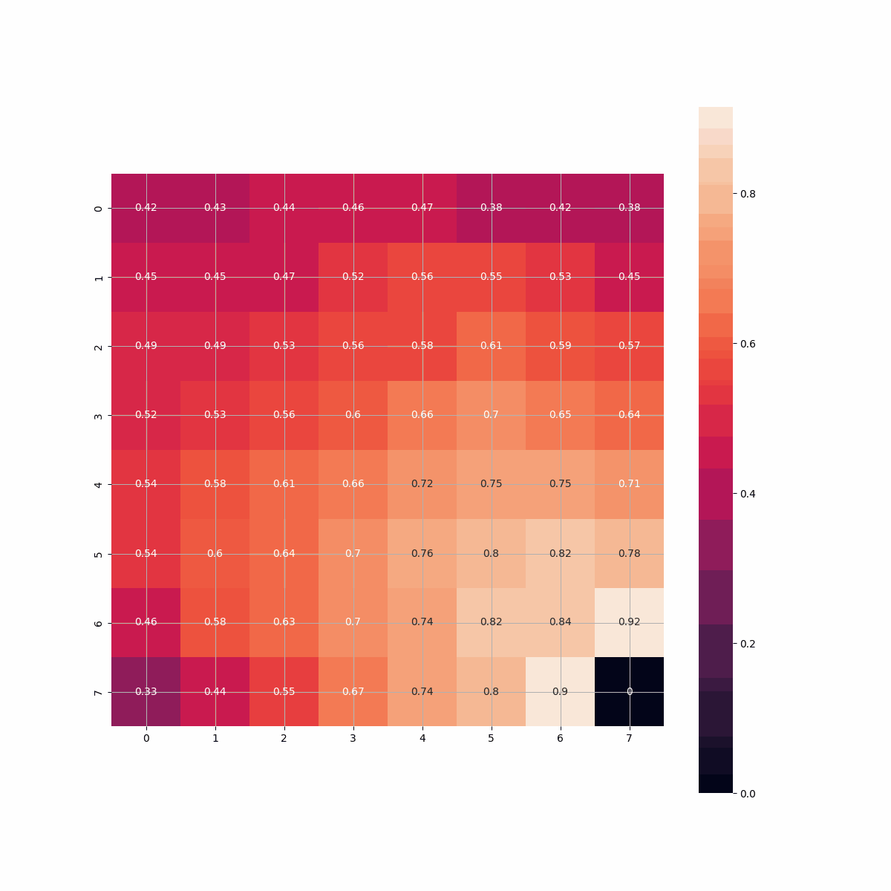

# Обучение с подкреплением с использованием модели мира
## Задача: реализация и анализ алгоритма Dyna на детерминированной и стохастической среде, основанной на среде из первого задания.

### Описание.

* Детерминированная среда
1. Реализовать табличный алгоритм Dyna на основе среды из первого задания.
2. Протестировать Dyna с различным количеством шагов планирования начиная с 0 (которое соответствует обычному Q-обучению).
3. Сравнить результаты в виде графиков суммарного вознаграждения и времени обучения для каждого значения шагов планирования.

* Стохастическая среда
1. Модифицировать среду, чтобы она стала стохастической, удостоверившись, что для каждого состояния и каждого действия 
существует как минимум два состояния с ненулевой вероятностью перехода.
2. Адаптировать алгоритм Dyna для учета стохастичности среды.
3. Предоставить аналогичные графики, как и в первой части задания.

* Что нужно сдать:
1. Код обучения в формате Jupyter.
2. Графики сходимости (среднее вознаграждение) и времени обучения для обеих сред (детерминированной и стохастической).
3. Таблицы с Q-значениями и моделью окружения (модель переходов).
4. Выводы по используемым гиперпараметрам, включая выбранное количество шагов планирования.

# Решение

Для решения задачи используется среда FrozenLake из *toytext* от gymnasium
## Пространство наблюдений
- начальное состояние (S) 
- конечное состояние (G) 
- зона для передвижения (F)
- ямы (нужно избегать) (H)

Карта может быть сделана путём комбинации состояний
```desc = ["SFFF", "FHFH", "FFFH", "HFFG"]```

Детерминированная карта размером 4x4 создаётся с помощью команды
```python
import gym
env = gym.make("FrozenLake-v1", map_name="4x4", is_slippery=False, render_mode="rgb_array")
```

Стохастическая карта размером 4x4 создаётся с помощью команды путём переключения ```is_slippery=False``` на ```is_slippery=True```
```python
import gym
env = gym.make("FrozenLake-v1", map_name="4x4", is_slippery=True, render_mode="rgb_array")
```

## Пространство действий

0. налево
1. вниз
2. вправо
3. вверх

## Вознаграждение

Дошёл до цели: +1
Упал в яму: 0
Сделал шаг: 0

## Алгоритм

Цель задания использовать алгоритм Dyna-Q реализация которого показана на рисунке ниже


Модель, которая накапливает знания о среде и семплирует прецеденты для дальнейшего обучения Q значений выглядит следующим образом

```python
import numpy as np
class Model:
    def __init__(self, n_states, n_actions, seed):
        self.mask_state = np.zeros([n_states], dtype=int)
        self.mask_state_action = np.zeros([n_states, n_actions], dtype=int)
        self.r = np.zeros_like(self.mask_state_action, dtype=float)
        self.next_s = np.zeros_like(self.mask_state_action, dtype=int)
        self._rng = np.random.default_rng(seed)

    def add(self, s: int, a: int, r: float, next_s: int) -> float:
        self.mask_state[s] = 1
        self.mask_state_action[s][a] = 1
        self.r[s][a] = r
        self.next_s[s][a] = next_s
        return r

    def sample(self) -> tuple[int, int, float, int]:
        """
        returns s, a, r, next_s
        """
        s = self._rng.choice(np.where(self.mask_state > 0)[0])
        a = self._rng.choice(np.where(self.mask_state_action[s] > 0)[0])
        return s, a, self.r[s][a], self.next_s[s][a]
```
Код можно посмотреть по этой ссылке хххххх


## Результаты

В данном репозитории сравниваются алгоритмы Q-learning и Dyna-Q на детерминированной и стохастической среде, 
причём будет проведено сравнение с оригинальным стохастическим распределением среды FrozenLake и переделанной.

В работе используются следующие гиперпараметры:

| learning rate | gamma | max epsilon | max epsilon | min epsilon | decay rate | num episodes | dyna updates |
|:-------------:|:-----:|:-----------:|:-----------:|:-----------:|:----------:|:------------:|:------------:|
|      0.7      | 0.95  |     1.0     |     1.0     |    0.05     |   0.0005   |     5000     |      10      |


В результате расчёта детерминированной среды алгоритмом Q-learning получаю следующие результаты:

* **Изменение Q-table от эпохи**



* **Изменение cреднего вознаграждения от эпохи** На 1000-ой эпохе агент достигает максимума.


* **Инференс**


В результате расчёта детерминированной среды алгоритмом Dyna-Q получаю следующие результаты:

* **Изменение Q-table от эпохи**


* **Изменение cреднего вознаграждения от эпохи** На 700-ой эпохе агент достигает максимума.


* **Инференс**


В результате расчёта стохастической среды алгоритмом Q-learning получаю следующие результаты:

* **Изменение Q-table от эпохи**


* **Изменение cреднего вознаграждения от эпохи**


* **Инференс**


В результате расчёта стохастической среды алгоритмом Dyna-Q получаю следующие результаты:

* **Изменение Q-table от эпохи**


* **Изменение cреднего вознаграждения от эпохи**


* **Инференс**


Стохастический режим FrozenLake накладывает очень большую шумность в обучение агента, так как выбранное действие имеет вероятность выполнения 0.33, а остальная вероятность делится между перпендикулярными действиями.
Пример.
Напомню, что индексы действий выглядят следующим образом
0. налево
1. вниз
2. вправо
3. вверх

Если выбрано действие вправо, то вероятность перехода будет выглядеть следующим образом ```[0, 0.33, 0.33, 0.33]```.
Данное распределение в большой среде, например 8х8, и с лунками (как задумано создателями среды FrozenLake) делаёт её прохождение практически невозможным.


Чтобы проверить меньшую вероятность, используются следующая модификация метода действия
```python
import random, env
def epsilon_random_policy(self, state, i):
    """make new probability distribution of action"""
    epsilon = self.min_epsilon + (self.max_epsilon - self.min_epsilon) * np.exp(-self.decay_rate * i)
    prob = [0.15, 0.15, 0.15, 0.15]
    if self._rng.uniform(0, 1) > epsilon:
        action = self.greedy_policy(state)
        prob[action] = 0.55
        action = random.choices(population=[0, 1, 2, 3], weights=prob, k=1)[0]
    else:
        action = env.action_space.sample()
        prob[action] = 0.55
        action = random.choices(population=[0, 1, 2, 3], weights=prob, k=1)[0]
    return action
```
Я использую исходное действия для перерасчёта вероятности выбора действия ```prob[action] = 0.55``` с дальнейшим сэмплированием действия ```action = random.choices(population=[0, 1, 2, 3], weights=prob, k=1)[0]```

В результате с более выраженной вероятностью сэмплирования ранее выбранного действия расчёт быстрее сходится и агент обучается доходить до цели.

В результате расчёта стохастической среды алгоритмом Q-learning получаю следующие результаты:

* **Изменение Q-table от эпохи**


* **Изменение cреднего вознаграждения от эпохи**


* **Инференс**


В результате расчёта стохастической среды алгоритмом Dyna-Q получаю следующие результаты:

* **Изменение Q-table от эпохи**


* **Изменение cреднего вознаграждения от эпохи**


* **Инференс**

